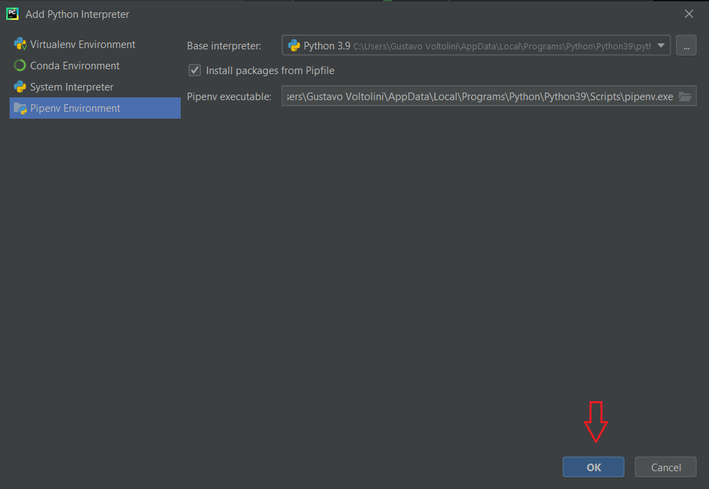

# LibraryManager

### Instalar:

Para instalar as dependencias crie uma Pipenv:

#### obs: E necessario ter "pipenv" instalado no seu python para seguir. 

---

Após a instalação execute o comando:

`pipenv install`

### Iniciar:

Execute o arquivo app/main.py

### Banco de dados:

Se desejar recriar o banco de dados, apague o arquivo "database.sqlite3" e execute o arquivo app/create_tables.py
